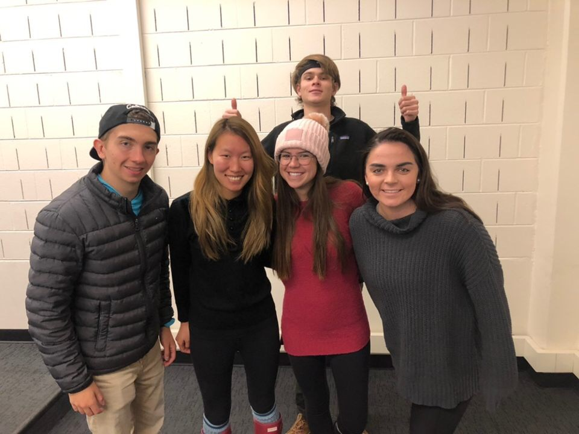
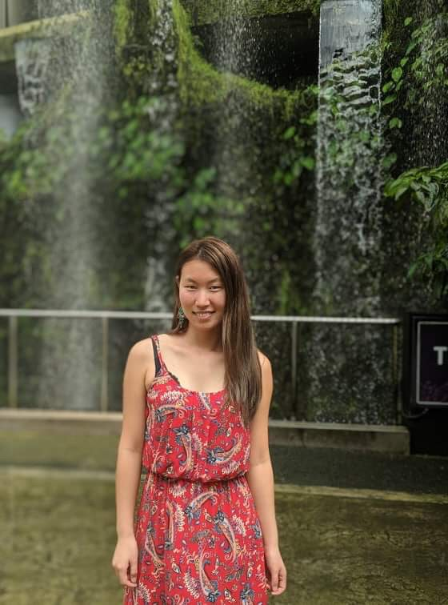

<<<<<<< Updated upstream
---
title: "Lab Assignment 2"
output:
  html_document:
    df_print: paged
---

RMArkdown file beginning

```{r}

```
#Team R-Kelly   



Team Goal:  As a team works together, one of our main team goals is to feel equally comfortable and sucessful with applying out knowledge of R and Data Science. As a team, we want to accomplish this by encouraging each other, helping each other, and making sure, everyone is up to speed.

-------

#About Our Members  

###Ping Li   
Photo:  

**About me**
  Hi, I am Ping. This is my second semester of Statistics and Data Science major. I am interested in helping people and society with my statistics skills. I want to know what projects that EWB(Engineers without Borders) is doing help people the most internationally. I want to know the refugee flow is affecting the whole world. I am hoping that after graduation, I can use my ststistics skill to work with an NGO to improve people's health and life. Years later, maybe five years, I am thinking to go back to grad school and to learn counseling. We will see how it will go. I can never gaurantee where I will be in 5 years. But, for sure, I want to use my knowledge to help people and hopefully, I can move around and live in different countries. I hope my future greatest career achievemnt can be my passion, and can be a way for me to know more culture and the local people. I hope my work is really improving their life. 
  I hope I can learn more about R skills and different ways/models to analyze data in this course. I hope I can learn more real skills that will be used in the future. I also expect myself to really master those skills by practicing more. 
  I love travelling so much and I really want to move to another country after a few years. Through my study abroad experiences, I learnt that even though I love moving to different places, I will stay at one place for at least 2-3 years before I think about moving. Staying at one place for a while is a good way to build and maintain good friendship and get to know the culture in a deeper level.
  
  Feedback from Lauren: I really enjoyed reading about your interest in Engineering without Borders, I think that it helps show your passion for improving peoples health and lives. 
  Feedback from Sasha: Hi Ping! Your ambitions sound amazing! Did you mention your greatest career achievement? Also you have a typo that you may want to fix (Statying)
  Feedback from Gregor:  I love the way you look at life, Ping. What do you mean exactly by saying you expect to "manage your skills with practicing?"
*****


*****

###Gregor Tzinov 
Photo:  
**About me**


* I'm interested in what discoveries in our universe can be made with the abundance of data we recieve from our satelites. Over the past couple of years through astronomy classes, I've learned how our universe is forever expanding, which makes me convinced that there is sophisticated life out there. I'm very curious in how data can help humans understand that.
* I would love to be gaining experience in the field of Data Science, whether that's through an internship or a full-time job. 5 years after that I would love to use my data analysis skills to become an important decision maker in some start-up tech company
* I hope my greatest career accomplishment will be finding a profession in a field that interests me, while also feeling I'm doing meaningful work. With this course, my biggest goal is to learn the techniques behind properly communicating my ideas.
* I spent 3 weeks in Thailand with my family. It was the best and most diverse vacation I've ever had, as it gave me a perspective of the East Asian world that I hadn't had before. 

Feedback from Sasha: Hi Gregor! Working for a startup sounds really cool, do you have any ideas for start ups currently?
Feedback from Lauren: The layout of your section mase it easy to comprehend which gave me a great understanding of your goals and personality. 
Feedback from Ping:  Your introduction layout is very clear. Your question is also very interesting, but you can also try to be more specific as the word "universe" is a big word. 

*****

###Sasha Maslowski   


* I am particularly interested in sports and would love to study/ analyze data similarly to the analyzation in Moneyball. Moneyball is a book and a movie that shows how a statistion took data from the game of baseball to improve it. It would be so cool to see how big data will change professional sports

* Six months after graduation I would love to move to a city like Boston or Seattle and be working for a professional sports program as a data scientist. I'm not exactly sure in what capacity I like to work in but there are a number of areas I'm interested in. So five years after graduation I would like to be established in my career path and have a better idea of what my path is.

* Hopefully throughout my career, I can use the tools I've been given to do meaningful work, solve important problems and serve a community!

* I currently play on the CU Women's Ice Hockey team. Although, I've been playing hockey for over 10 years, this by far has been the best experience of my life. I've been able to meet so many wonderful girls, learn so many valuable life lessons and have SO many unreal experiences.

Feedback from Lauren: By encorporating sports into all of your answers really helps the audience see your passion and dedication to sports! 
Feedback from Ping: Applying statistics to Sports is so cool especially this is your hobby. It looks like you have a clear mind of what you want. If you can have a more specific example of the question that you want to solve, that would be even better.
Feedback from Gregor:  I think it's awesome that you want to apply Data Science in the world of sports, I have also given that some thought. One suggestion: for those that haven't seen moneyball, they would be a little confused on what the analyzation is in that movie exactly, maybe add a brief summary?

*****
###Lauren Tafoya  


* I would love to use data analyzing methods in investment research. I currently work as an investment researcher for a Wealth Management firm, and knowing how to effectively organize and analyze data would be so helpful with the process. 

* Six months after graduation I would love to be working in New York doing Equity Research and Financial Analysis. Five years for now I would love to be settled in an awesome job while also pursing my passion for videography. 

* I hope my greatest career accomplishment will be owning my own firm. This course can help me acheive my goal as it will teach  my important organization and collaboration skills.

* I am a member of the Kappa Kappa Gamma sorority and just finished my term as President of our Chapter. It was truly the most amazing experience I could ever ask for, in which I learned many problem solving and team collaboration skills. 


Feedback from Gregor: I think your aspirations for the future are awesome, and it seems like you're on a great path to achieve them. You might want to add what you learned exactly in your sorority and how it changed you exactly, I'm curious to hear.  
Feedback from Sasha: Hi Lauren! You sound like you have a clear plan which is amazing! Do you have a specific type of firm you'd like to own?
Feedback from Ping: Your introducton layout and content is very clear. It looks like you really know what you want to do and you are really working on it. It will be even better if you can say more about the firm(ex, what does the  firm do) that you want to own in the furture.
*****
###Peter Bullard 


* I am interested in the theoretical limit of prediction based on statistical features of a given problem, which I think can be roughly guess through data science.  

* Six months after graduating, having a job in my preferred field would be nice. Five years from graduation, I would hope to still have gainful employment.  
  
* My greatest career accomplishment will be working on the projects I find to be most interesting or complex, and I hope to expand my skillset for solving these probelms in this course.   
 
* It is overwhelmingly likley that I hold the world record for most second place finishes in regional youth pipe organ competitions.  
 
 Feedback from Lauren: The use of a hyperbole in your last statement gave an awesome snip of your personality. Additionally you could include any idea of projects that may be interesting to you.
 Feedback from Ping: Your introduction shows your amibition and passion. Motivation of fun and achievement is always a good way to keep you up to something. If you can explain more about regional youth pipe organ competitions, that would be even better.
Feedback from Gregor: I also love the last line, that's super cool you've done such competitions before though. What sort of projects do you think you'll find interesting or complex? Do you have any initial interests?
Feedback from Sasha: The last line is great! Do you have specific preferred field? Is it related to your previous question?