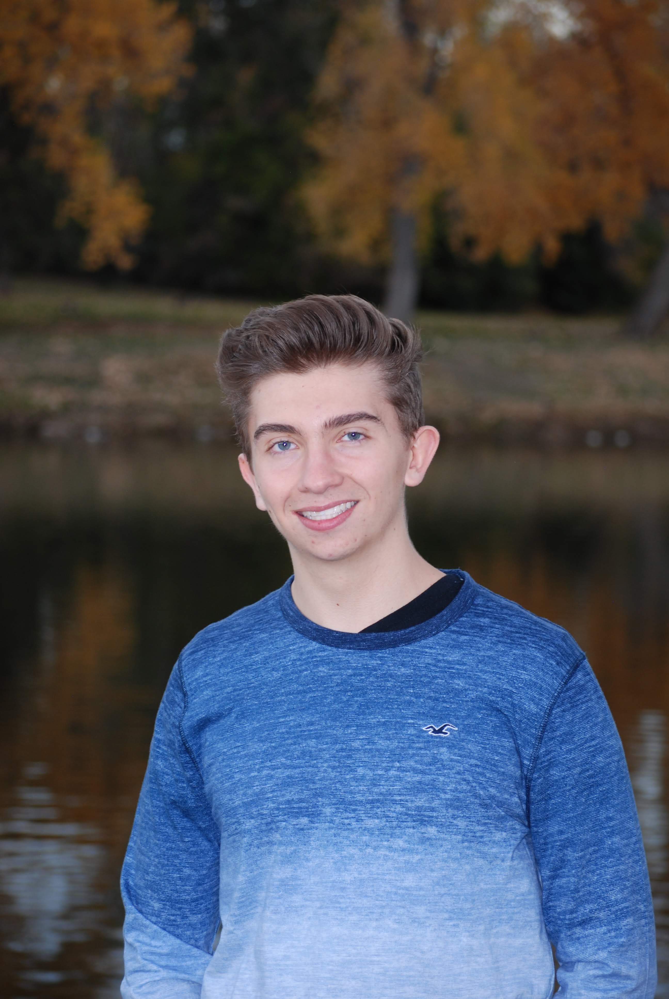
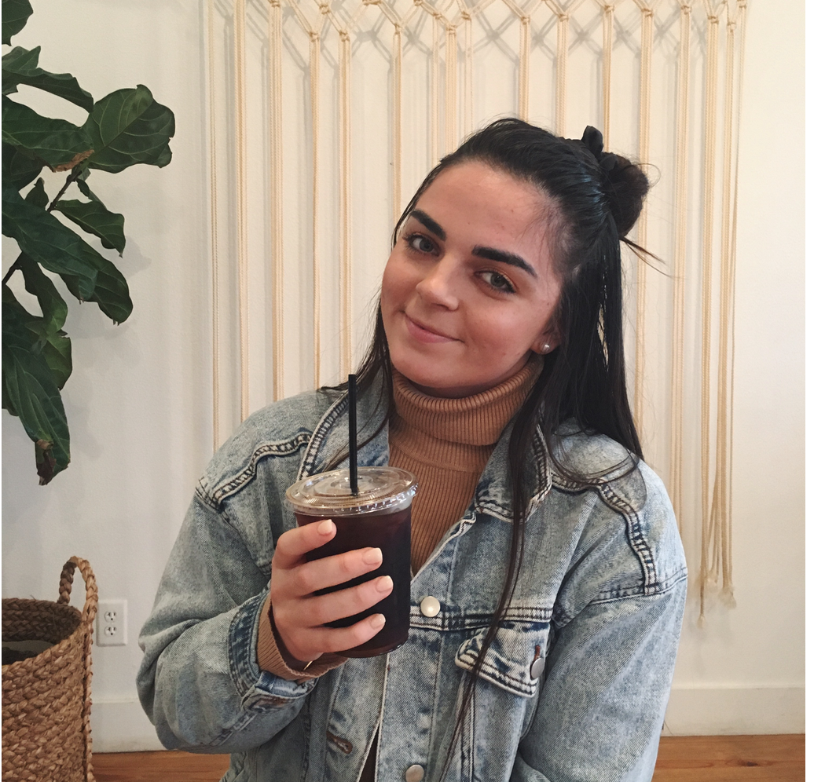
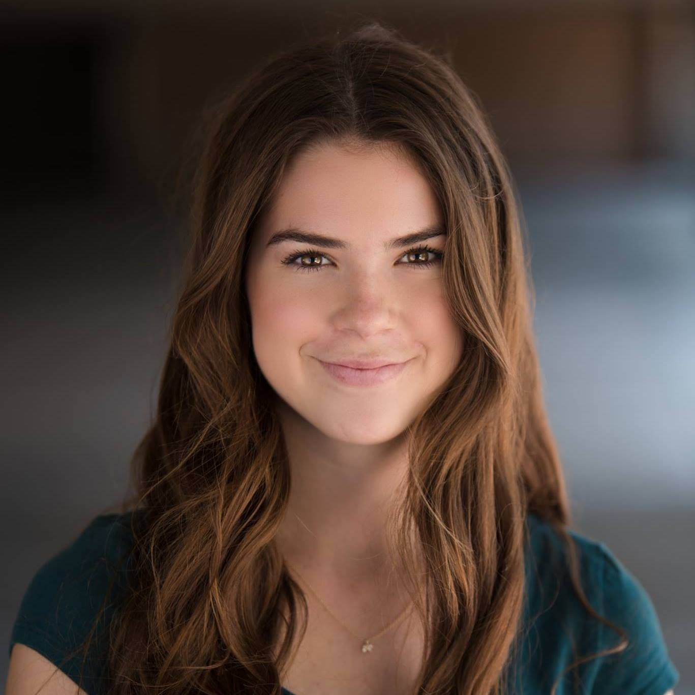
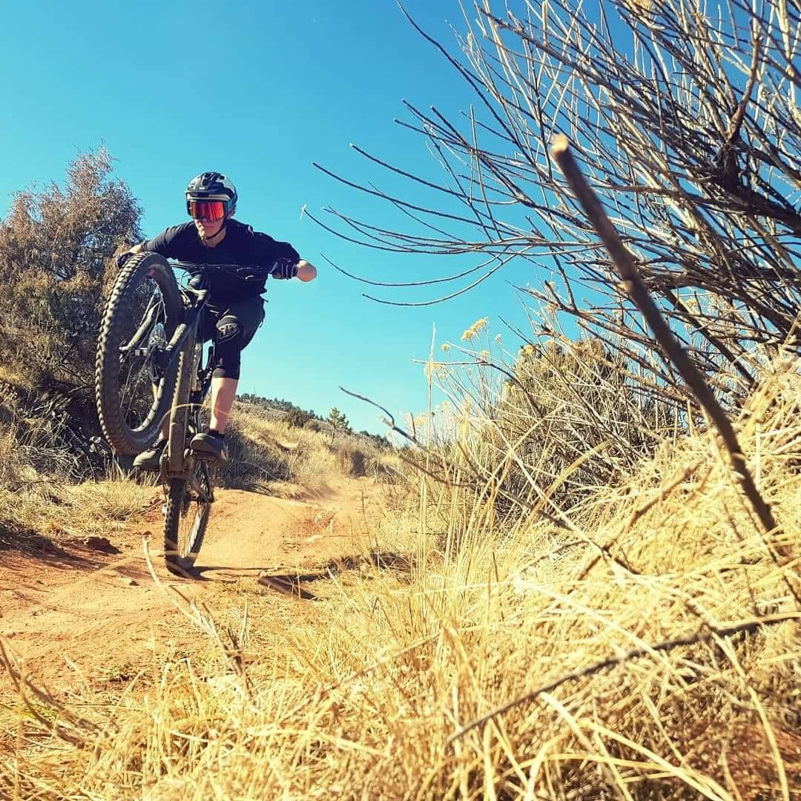

<<<<<<< Updated upstream
---
title: "Lab Assignment 2"
output: html_notebook
---

RMArkdown file beginning

```{r}

```
#Team R-Kelly  


Team Goal:  As a team works together, one of our main team goals is to feel equally comfortable and sucessful with applying out knowledge of R and Data Science. As a team, we want to accomplish this by encouraging each other, helping each other, and making sure, everyone is up to speed.

-------

#About Our Members  

###Ping Li   
Photo:  

**About me**
  Hi, I am Ping. This is my second semester of Statistics and Data Science major. I am interested in helping people and society with my statistics skills. I want to know what projects that EWB(Engineers without Borders) is doing help people the most internationally. I want to know the refugee flow is affecting the whole world. I am hoping that after graduation, I can use my ststistics skill to work with an NGO to improve people's health and life. Years later, maybe five years, I am thinking to go back to grad school and to learn counseling. We will see how it will go. I can never gaurantee where I will be in 5 years. But, for sure, I want to use my knowledge to help people and hopefully, I can move around and live in different countries. I hope my future career can be my passion, and can be a way for me to know more culture and the local people. I hope my work is really improving their life. 
  I hope I can learn more about R skills and different ways/models to analyze data in this course. I hope I can learn more real skills that will be used in the future. I also expect myself to really manage those skills by practicing more. I expect myself to be more involved with the work we need to do.
  I love travelling so much and I really want to move to another country after a few years. Through my study abroad experiences, I learnt that even though I love moving to different places, I will stay at one place for at least 2-3 years before I think about moving. Statying at one place for a while is a good way to build and maintain good friendship and get to know the culture in a deeper level.

*****

###Gregor Tzinov 
Photo:  
**About me**


* I'm interested in what discoveries in our universe can be made with the abundance of data we recieve from our satelites. 
* I would love to be gaining experience in the field of Data Science, whether that's through an internship or a full-time job. 5 years after that I would love to use my data analysis skills to become an important decision maker in some start-up tech company
* I hope my greatest career accomplishment will be finding a profession in a field that interests me, while also feeling I'm doing meaningful work. With this course, my biggest goal is to learn the techniques behind properly communicating my ideas.
* I spent 3 weeks in Thailand with my family. It was the best and most diverse vacation I've ever had, as it gave me a perspective of the East Asian world that I hadn't had before. 

Feedback from Ping:  Your introduction layout is very clear. Your question is also very interesting, but you can also try to be more specific as the word "universe" is a big word. 
*****
###Sasha Maslowski   


*****
###Lauren Tafoya  


* I would love to use data analyzing methods in investment research. I currently work as an investment researcher for a Wealth Management firm, and knowing how to effectively organize and analyze data would be so helpful with the process. 

* Six months after graduation I would love to be working in New York doing Equity Research and Financial Analysis. Five years for now I would love to be settled in an awesome job while also pursing my passion for videography. 

* I hope my greatest career accomplishment will be owning my own firm. This course can help me acheive my goal as it will teach  my important organization and collaboration skills.

* I am a member of the Kappa Kappa Gamma sorority and just finished my term as President of our Chapter. It was truly the most amazing experience I could ever ask for, in which I learned many problem solving and team collaboration skills. 

Feedback from Gregor: I think your aspirations for the future are awesome, and it seems like you're on a great path to achieve them. You might want to add what you learned exactly in your sorority and how it changed you exactly, I'm curious to hear.  
Feedback from Ping: Your introduction layour and content are very clear. It looks like you really know what you want to do with the skills you have and you are learning.
*****
###Peter Bullard 


* I am interested in the theoretical limit of prediction based on statistical features of a given problem, which I think can be roughly guess through data science.  

* Six months after graduating, having a job in my preferred field would be nice. Five years from graduation, I would hope to still have gainful employment.  
  
