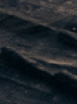

RMArkdown file beginning

```{r}

```
#Team R-Kelly  


-------

#About Our Members  

###Ping Li   
Photo:  

*****
###Gregor Tzinov 
Photo:  

*****
###Sasha Maslowski   


*****
###Lauren Tafoya  


* I would love to use data analyzing methods in investment research. I currently work as an investment researcher for a Wealth Management firm, and knowing how to effectively organize and analyze data would be so helpful with the process. 

* Six months after graduation I would love to be working in New York doing Equity Research and Financial Analysis. Five years for now I would love to be settled in an awesome job while also pursing my passion for videography. 

* I hope my greatest career accomplishment will be owning my own firm. This course can help me acheive my goal as it will teach  my important organization and collaboration skills.

* I am a member of the Kappa Kappa Gamma sorority and just finished my term as President of our Chapter. It was truly the most amazing experience I could ever ask for, in which I learned many problem solving and team collaboration skills. 

*****
###Peter Bullard 



